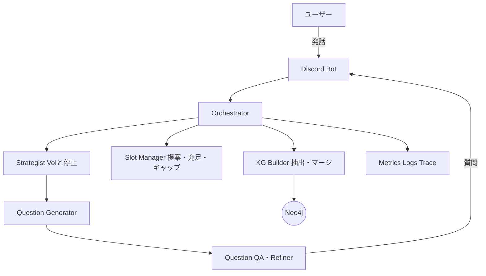
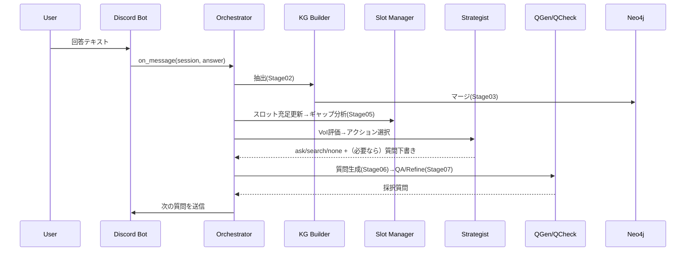

## 好奇心駆動インタビューエージェント 最終設計書

本ドキュメントは、好奇心（Curiosity）を内在化したインタビューエージェントの最終完成形を示す。目標は、人間の記者/インタビュワーのように不足情報を自律的に検出し、価値の高い最小質問で対話を収束させ、最終的に高品質な成果物（手順書・ポストモーテム・レシピ・業務報告）を安定的に生成すること。

---

### 0. エグゼクティブサマリー
- 目的: 不足情報を自動検出し、最小質問で「不完全→完全」に導く好奇心駆動エージェントを構築する。
- アプローチ: スロット/ギャップ管理＋VoI（情報価値）で行動選択（ask/search/none）と停止規則を制御。LLMは抽出・質問生成・リファイン等の生成部分に限定。
- ドメイン: 手順書 / ポストモーテム / レシピ / 業務報告（4テーマ）。
- 主要KPI: 重要スロット充足率、重複質問率、平均ターン数、生成物品質、満足度。
- ロードマップ: M1a（最小ポストモーテム）→ M1b（永続化/可観測）→ M1c（4テーマ拡張）→ M2（VoI導入）→ M3（評価高度化）。
- 品質担保: JSON厳格/スキーマ検証、A/Bで停止規則/閾値校正、WAL/トレースで再現性を確保。

### 1. ビジョンとスコープ
- 目的: 不完全な情報を完全な情報へ導く。対話を通じ、知識ギャップを特定し、最小の質問で埋める。
- 成果物: 以下4テーマの高品質ドキュメント
  - 手順書（SOP/Runbook）
  - ポストモーテム（Incident Review）
  - レシピ（Recipe）
  - 業務報告（日次/週次レポート）
- 成功条件: 重要スロットの充足率が高く、重複質問が少なく、必要ターン数が短く、生成物が再現性・検証性を満たす。

---

### 2. 報酬関数と価値関数（不足検知 + 好奇心）

#### 2.1 スロット／ギャップモデル
- セッションごとに `SlotRegistry` を持ち、各スロットに以下を保持:
  - name, description, type, importance ∈ [0,1], filled, last_filled_ts
- 充足判定: 抽出されたKG断片/回答からスロットの値が得られたら `filled=True` に更新。
  - モデルの詳細は「10.1 セッション状態・データモデル」を参照。

#### 2.2 不足情報のスコア（Gap Priority：正準式）
- 直感: 重要で、まだ埋まっておらず、長らく埋まっていないほど優先度が高い。
- 正準式: priority = importance × (1 − filled_ratio) × staleness
  - staleness = 1 − exp(−Δt/τ)（Δt: 最終充足からの経過時間）
  - filled_ratio ∈ [0,1]（confidence・正規化一致・出所信頼の合成）
  - 詳細は 10.2 を参照

#### 2.3 好奇心の価値関数と停止（EVSI近似・二段停止）
- 目的: 次のアクション（ask/search/none）が「ギャップ充足」と「成果物KPI」へ与える期待改善を評価。
- 正準式（スロット単位EVSI近似）:
  - VoI_ask = ((P(answerable) × Δfilled) × value) / cost_ask
  - VoI_search = ((retrievability × Δfilled) × value) / cost_search
  - value = importance × critical_weight + coverage_bonus
  - Δfilled ≈ min(1 − filled_ratio, quality_expectation)
- 停止規則（二段）:
  1) ハード停止: 重要スロットの目標充足到達かつ重大ギャップ=0
  2) ソフト停止: max(VoI_ask, VoI_search) < τ_stop（未達時は未充足の見える化を提示）

#### 2.4 報酬関数と学習（研究トラックへの移設）
本節で扱う報酬設計・学習方法は、任意の研究トラック（R4）で方策最適化を検討する際の参考として付録Rに移設する。M1〜M3はLLM API中心のシステム最適化（VoI/停止/KPI校正）に焦点を当て、学習アルゴリズムは前提としない。

---

### 3. LLMアーキテクチャ設計（モジュール/データフロー）

#### 3.1 モジュール構成
- Strategist: VoIベースで ask/search/none を選択。
- KnowledgeIntegrator: 検索統合（BM25/ベクトル/RRF/再ランク）、文抽出、エビデンス化。
- KG Builder: 抽出（Stage02）とマージ（Stage03）。信頼度添付とNeo4jへの反映。
- Slot Manager: スロット提案（Stage04）、ギャップ分析（Stage05）、充足更新。
- Question Generator: スロット別テンプレ×生成（Stage06）。
- QA/Refiner: 質問品質検証（Stage07）＋記者スタイルの1文洗練（journalist）。
- Orchestrator: 1ターンの制御（観測→決定→行動→更新）。

備考（責務分離/プラグイン方策）:
- Orchestratorの意思決定は `PolicyProvider` としてプラグイン化（`heuristic_voi | bandit | offline_policy | safe_rl`）。
- 既定は `heuristic_voi`。研究トラック（R4）では他方策を使用可。ただし逸脱率/KPIゲートを必須とし、異常時は即時 `heuristic_voi` へ切り戻す。

#### 3.2 ターン内フロー
1) 観測: ユーザ回答、既知KG、SlotRegistry を集約
2) 状態更新: 抽出→マージ→充足更新→ギャップ再計算
3) 決定: Strategist が VoIで ask/search/none を選択
4) 行動: 対象スロットに対する質問生成（→QA/Refine→提示）
5) ログ/計測: スロット充足率/重複/VoI/停止判定を記録

#### 3.3 プロンプトI/Fの原則
- すべて JSON 厳格（コードフェンス排除）
- スキーマ明示（entities/relations、slot_name/text、specificity/tacit_power 等）
- ドメイン定義（4テーマ）に応じた system 指示とテンプレ例を付与

#### 3.4 システム構成図（Mermaid）


#### 3.5 1ターン処理フロー（Mermaid）


---

### 4. LLM APIを用いた擬似的な好奇心システム

#### 4.1 方針
- “好奇心”をLLM内に学習させる前段として、外部で状態（KG/スロット/VoI）を管理し、LLMには必要最小の生成（抽出/質問/リファイン）だけを委譲。

#### 4.2 実装上の要点
- 抽出: JSONモード/関数呼び出しで堅牢に（Stage02）。
- マージ: 失敗しても対話を止めない（Stage03は非致命）
- ギャップ: `SlotRegistry` を常時更新し、`stage05_gap` の優先度でスロット選択。
- 生成: `stage06_qgen` でテンプレ補完→ `stage07_qcheck` で品質スコア閾値（例0.7〜0.8）
- リファイン: journalistの `question_refiner`/`interviewer_turn` で1–2文化。
- フォールバック: LLM失敗時は安全な既定質問へ。
  - `SlotRegistry` の構造は「10.1」を参照。

#### 4.3 Discordファーストの結線
- `on_message` 内: 抽出→マージ→充足更新→ギャップ優先→質問生成→QA/Refine→返信→last_question更新。
- セッション状態は最初はインメモリ、必要に応じてRedis/DBへ永続化。

---

### 5. ドメイン特化（4テーマ）

#### 5.1 手順書（SOP/Runbook）
- クリティカルスロット: 目的/前提/環境/手順/分岐/検証/ロールバック/危険事項/チェックリスト
- KPI: 分岐の網羅率、検証項目の明確性、ロールバック有無、再現成功率
- 代表質問: 「この手順の目的は？」「分岐の判断基準は？」「各重要ステップの期待結果は？」

#### 5.2 ポストモーテム
- スロット: 概要/影響/検知・TTD/タイムライン/根本原因/共起要因/対処/是正・予防策/学び
- KPI: タイムライン充足率、RCAの明確性、CAPAの具体性（owner/期限/成功基準）
- 代表質問: 「1文サマリは？」「影響範囲の定量/定性は？」「CAPAの期限と成功基準は？」

#### 5.3 レシピ
- スロット: 料理名/人数/材料(単位)/器具/下ごしらえ/工程(温度・時間)/代替/失敗例/保存
- KPI: 単位整合率、温度/時間記載率、代替・制約対応数、再現成功率
- 代表質問: 「分量を単位つきで？」「各工程の温度と時間は？」

#### 5.4 業務報告
- スロット: 対象/今日のプロジェクト/実施タスク/成果物/ブロッカー/次の一歩
- KPI: 成果物リンク率、ブロッカー記載率、翌日の行動可能性
- 代表質問: 「具体タスクは？」「成果物のURLは？」「明日の一歩は？」

---

### 6. マイルストーン（ロードマップ：本線と研究トラック）

本線（プロダクト本流）

M1a: 最小ギャップ駆動ループ（PM 5スロット）
- 対象: ポストモーテムのみ、重要5スロット
- 実装: 抽出→マージ→充足更新→`stage05_gap`→質問生成→QA→返信（Discord）
- 受入: 10セッション中8件でタイムライン完備、重複質問率≤10%

M1b: スロット永続化と可観測性
- 実装: `SlotRegistry` 永続化（Redis/SQLite）、主要メトリクス導入（充足率/重複率/レイテンシ）
- 受入: 再起動後のセッション継続、ダッシュボードでKPI可視化

M1c: 4ドメインMVP（重要スロット充足率 ≥ 0.7）
- 実装: `planners.yaml`/スロット集合の整備、出力テンプレ整形

M2: VoI/停止規則の導入・暫定校正
- 実装: Strategistの重み（p_user_can_answer, retrievability, cost, τ_stop）を設定化
- 受入: A/Bでターン数↓10%以上、重複率↓20%を達成

M3: 評価・校正の高度化
- 実装: ゴールド/合成データでオフライン評価、qcheck閾値とプロンプトの最適化
- 受入: 主要KPIの目標値達成（付録Bのtarget参照）

研究トラック R4（任意・段階導入）

R4a: ハイパラ最適化（バンディット/ベイズ最適化）
- 作用点: τ_stop, qcheck閾値, importance補正, 温度T 等（LLM改変なし）

R4b: オフライン方策改善（OPE/保守的改善）
- 作用点: ask/search/none＋スロット選択（Orchestratorの意思決定）

R4c: 安全制約付きオンラインRL（フェイルオーバー常備）
- 作用点: Orchestratorの意思決定（LLMはAPI中心のまま）

R4d: LLM微調整（DPO/GRPO/RLAIF）
- 研究限定。JSON厳格/幻覚率/本線KPI維持にハード制約。

---

### 7. 評価・計測
- スロット充足率（重要スロット）
- 重複質問率、不要質問率
- 完了までの平均ターン数、停止判定の適時性
- 生成物品質: レビュー修正回数、再現成功率、タイムライン整合率、温度/時間記載率 等
- ユーザ満足度（Likert）、応答レイテンシ、失敗率

---

### 8. リスクと対策
- 幻覚/不整合: JSON厳格/スキーマ検証、根拠スニペット提示、Neo4j制約
- 冗長/重複: SlotRegistryで充足制御、重複検出、QAスコア閾値を上げる
- コスト/遅延: キャッシュ、並列化、スロット束ね質問、温度・コンテキスト長の最適化
- センシティブ情報: PIIマスク、権限境界、ログの最小化/匿名化

---

### 9. 実装メモ（現行コードとの対応）
- 結線ポイント:
  - `nani_bot.py` の `on_message` で: 抽出(Stage02)→マージ(Stage03)→スロット充足更新→`analyze_gaps`(Stage05)→`generate_questions`(Stage06)→`return_validated_questions`(Stage07)→journalistリファイン→返信
  - `SlotRegistry` はセッション状態に常駐、必要に応じRedis/DBへ永続化
  - Neo4jは同期/非同期いずれも可（失敗非致命）
- プロンプト管理:
  - 4ドメインのゴール/ステップは `agent/prompts/planners.yaml` を中核に
  - journalistで共感・洗練、qgen/qcheckで構造化
- 設定:
  - `EL_AGENT_REQUIRED=0`（初期はフォールバック重視）
  - `EL_TRACE=1` で対話の可観測性を確保
  - `SlotRegistry` のデータモデル・重複防止は「10.1/10.2」を参照。

---

以上。まずは M1 を達成し、4ドメインでKPIを継続測定しながら M2/M3 を素早く反復する。VoI導入後に停止規則が安定すれば、少ないターンで高品質な最終成果物を一貫して生成できるようになる。

---

### 10. 詳細仕様（漏れのない定義）

#### 10.1 セッション状態・データモデル
- SessionState（概念）
  - user_id: str
  - topic: str
  - language: {Japanese, English}
  - messages: [{timestamp, question, answer}]
  - goal_kind: {sop, postmortem, recipe, daily_work}  # 拡張: requirements/generic 等は任意
  - SlotRegistry: Map[name → Slot]
  - hypothesis: {id, text, belief, belief_ci, action_cost, slots}
  - last_question: str | null
  - last_supports: [str]
  - belief_updated: bool
  - created_at: iso8601

- Slot（抽象/正準）
  - name: str, description: str, type: str|null
  - importance ∈ [0,1], filled_ratio ∈ [0,1], last_filled_ts: epoch|null
  - evidence_ids: [Fact.id], source_kind: {user, retrieval, model_infer, mixed}
  - 備考: 互換のため `filled` は派生（filled_ratio≥θ_filled で True）

- KG（最小）
  - entities: [{id, label, type?, confidence?}]
  - relations: [{source, target, type, confidence?}]

#### 10.2 ギャップ分析（Stage05）
- 推奨式（方向性修正・連続化）
  - staleness_s = 1 − exp(−Δt_s / τ)   （Δt_s: 最終充足からの経過時間、τ: 時定数）
  - filled_ratio_s ∈ [0,1] ＝ clamp(w_conf·confidence + w_norm·normalized_match + w_src·source_trust, 0, 1)
  - priority_s = importance_s × (1 − filled_ratio_s) × staleness_s
- 運用ヒント
  - 直接抽出: 回答→KG抽出のエンティティ/リレーション一致（同一id/同義語）
  - 正規化: 数値・単位・日付・URLの正規化器で一致度を算出
  - 暫定/確定: confidence ≥ c_min（例0.5）で暫定充足、低ければ補強質問を優先
  - 集中: softmax温度Tでpriority分布化し、上位kスロットに集中配分

#### 10.3 意思決定（VoI/停止：EVSI近似・二段停止）
- 不確実性（参考）: u = H(b) = −b log2 b − (1−b) log2 (1−b)、b ∈ (0,1)
- スロット単位の期待改善（EVSI近似）
  - value_s = importance_s × critical_weight + coverage_bonus_s
  - Δfilled_s ≈ min(1 − filled_ratio_s, quality_expectation_s)
  - gain_ask_s = P(answerable_s|context) × Δfilled_s
  - gain_search_s = retrievability_s × Δfilled_s
  - VoI_ask_s = (gain_ask_s × value_s) / cost_ask、VoI_search_s = (gain_search_s × value_s) / cost_search
- 行動選択: argmax_s max(VoI_ask_s, VoI_search_s)
- 束ね質問（任意／初期ルール）:
  - スロット集合 S に対し、cost_ask(S) = base + Σ_s marginal_cost_s − synergy(S)
  - 初期ルール: 同一前提・同一文脈に依存するスロットの集合Sでは synergy(S) ≈ 0.15 × Σ_s marginal_cost_s
  - 比較候補として VoI_ask(S) = (Σ_s gain_ask_s × value_s) / cost_ask(S) を評価
- 停止規則（二段）
  1) ハード停止: 重要スロット充足率 ≥ target（例0.85）かつ 重大ギャップ=0
  2) ソフト停止: max_s max(VoI_ask_s, VoI_search_s) < τ_stop（KPI未達の場合は“未充足の見える化”を提示）
- 初期値目安: P(answerable)=0.6, retrievability=0.7, cost_ask=1.0, cost_search=0.5, τ_stop∈[0.05,0.12]

#### 10.4 信念更新
- ロジット空間で更新: b′ = σ(logit(b) + Δ)
- Δの算出（2系統）
  - 校正済みLR: Δ = intercept + Σ w_i·f_i（features: cosine, source_trust, recency, logic_ok, redundancy, polarity_sign）
  - ヒューリスティック: 重み付き平均→符号（支持/反証）で符号付け、スケール係数で拡大
- CI縮小: 幅 = 幅/(1+|Δ|)、最小幅0.05。b′±幅/2 を [0,1] にクリップ
- 既定重みの初期値: cosine=0.6, source_trust=0.3, recency=0.2, logic_ok=0.4, redundancy_penalty=-0.2

#### 10.8 動的パラメータ推定（オンライン適応）
- P(answerable_s): 直近の未回答率/応答時間/質問の具体性/役割等から回帰（LR/GBDT）
- retrievability_s: QPP（クエリ予測性能）＋BM25スコア分散＋ベクトル類似ピーク度
- cost_ask/search: 実測（応答遅延/トークン/外部API遅延）から移動平均で更新

#### 10.9 QCheck運用定義と注釈
- specificity: 単位/制約/時刻/温度など構造化属性の含有率（注釈ガイドで例示）
- tacit_power: 暗黙情報（前提/意図/判断基準）を顕在化させる設問率
- 校正: 各スロット10–20例でROCをとり、運用閾値を設定（付録BのKPIと連動）

#### 10.7 スロット重要度（importance）の定義
- ドメインテンプレでクリティカルスロットに高重み（例: 0.8〜1.0）、補助スロットは0.3〜0.6
- 動的補正: 未充足が継続する重要スロットは徐々に増重、直近充足は微減重
- 最低保証: すべてのスロットにmin_importance（例0.2）を設定し、探索性を確保

#### 10.5 プロンプトI/F（JSON厳格）
- 抽出(Stage02): 入力 system + user（schema提示）→ 出力 {entities, relations} | function_call(save_kv)
- スロット提案(Stage04): 入力 KG(JSON) + topic → 出力 [{name, description, type?}]
- 質問生成(Stage06): 入力 slots→テンプレ補完例→出力 [{slot_name, text}]
- 質問QA(Stage07): 入力 [{slot_name, text}] → 出力 [{slot_name, text, specificity, tacit_power}]
- 記者リファイン: 入力（下書き質問/前置き）→ 1–2文の完成テキスト
- 必須: コードフェンス排除、空/無効は再試行またはフォールバック

#### 10.6 失敗時挙動・フォールバック
- LLMエラー/無効JSON: 1回再試行→失敗時は保守的既定質問（ドメイン別）
- Neo4j失敗: 会話継続（ログ警告、後追い再試行）
- ギャップゼロ/停止条件: 生成物サマリへ移行

---

### 11. ドメイン仕様詳細（4テーマ）

#### 11.1 手順書（SOP）スロット完全表
- objective, prerequisites(権限/環境/資材/認証), environment(scope, prod/stg, blast_radius, rollbackable)
- steps[{id, desc, cmd?, expected?, owner?, risk?}], branches[{cond, path}], validation[{obs, pass_criteria}], rollback[{case, steps}]
- hazards[{type, impact, mitigation}], checklist[...], references[URL], timestamps
- 既定質問セット（抜粋）: 目的/分岐/検証/ロールバック/危険事項

#### 11.2 ポストモーテム
- summary(1文)、impact(users, revenue, functions, duration)、detection(method, TTD)、timeline[{t, action, result}]
- root_cause(tech/process/org)、contributing_factors、remediation、CAPA[{owner, due, success}], lessons
- 既定質問: タイムライン欠落埋め、RCAの因果列挙、CAPAの成功基準

#### 11.3 レシピ
- basic(dish, servings)、ingredients[{name, qty, unit}]
- tools、prep、steps[{temp, time, heat, desc}]、substitutions、pitfalls、storage
- 既定質問: 分量単位、温度/時間、代替・制約対応

#### 11.4 業務報告
- subject、projects、tasks[{desc, time_spent, link?}]、artifacts[PR/docs/deploy]、blockers、next_step
- 既定質問: 成果物URL、ブロッカー原因・対処、翌日の一歩

---

### 12. 知識グラフ仕様詳細

#### 12.1 データモデル/制約（Neo4j推奨）
- ノード: Entity{id, label, type, confidence}, Fact{id, text, belief, impact, status}, Approval{id, fact_id, decision, approver?, ts}
- リレーション: (Entity)-[:RELATION{type, confidence}]->(Entity), (Fact)-[:REQUIRES_APPROVAL]->(Approval)
- インデックス: Entity(id), Fact(id), Approval(id)
- 一意制約: idにユニーク制約

#### 12.2 マージ方針
- id優先、同義語/正規化（例: URL正規化、数値単位換算）
- confidence 更新は max/加重平均のいずれか（ドメイン調整）
- 由来（provenance）とバージョン（ts）をWAL/メタに保存

#### 12.3 代表Cypher（例）
```
// Entity upsert
UNWIND $entities AS e
MERGE (n:Entity {id: e.id})
SET n.label = e.label, n.type = e.type, n.confidence = e.confidence

// Relation upsert
UNWIND $relations AS r
MATCH (s:Entity {id: r.source}), (t:Entity {id: r.target})
MERGE (s)-[rel:RELATION {type: r.type}]->(t)
SET rel.confidence = r.confidence
```

---

### 13. 評価設計詳細
- オフライン
  - 合成/実データでスロット正解を用意、充足率/誤充足率/質問採用率/ターン数/停止適時性を測定
  - プロンプト/VoI/閾値のアブレーション
- オンライン（Discord）
  - CTR/応答率、重複質問率、タスク完遂率、ユーザ満足度（Likert）
  - A/B: τ_stop, qcheck閾値, リファイン有無
- 最終生成物評価
  - SOP: 分岐網羅、検証の明確性、ロールバック定義
  - PM: タイムライン整合、RCA明確性、CAPA具体性
  - レシピ: 単位整合、温度/時間記載、再現成功
  - 業務報告: 成果物リンク、次の一歩の具体性
 - KPI仕様: 付録Bの `kpi_definitions` を参照（数式/測定単位/目標値）

---

### 14. 運用・可観測性
- 設定: OPENAI_MODEL, OPENAI_API_KEY, NEO4J_URI/USER/PASSWORD, EL_AGENT_REQUIRED, EL_TRACE
- ログ/トレース: WAL（イベント）、trace(stage/kind/payload)、PIIマスク既定ON
- メトリクス: LLM呼数/失敗率/レイテンシ、質問採用率、重複率、停止適時性
- レイテンシ予算: 抽出≤800ms, qgen≤600ms, refiner≤400ms（モデル/長さ依存）
- 再試行/サーキットブレーカ: LLM/Neo4jに適用、指数バックオフ

---

### 15. テスト戦略
- 単体: Stage01〜07 の入出力整合、JSON厳格パース、境界値
- 結合: 抽出→スロット→質問→QA のパイプライン（モックLLM）
- E2E（Discord）: 4ドメイン代表ケース、フォールバック経路、停止規則
- プロパティテスト: 正規化器（単位/日付/URL）

---

### 16. セキュリティ/コンプライアンス
- PII: マスク（ユーザID/トークン/連絡先）、保存最小化
- モデレーション: 不適切表現のフィルタ、ドメインに応じた安全ガード
- 権限: Discordボット権限の最小化、Neo4j資格情報の保護

---

### 17. コスト/レイテンシ最適化
- キャッシュ: スロット提案/リファイン結果の短期キャッシュ
- コンテキスト圧縮: 直近kターン＋要約、RAGキーの利用
- バッチ: 複数スロットの質問をまとめて評価
- モデル選定: qgen/qaは軽量、refinerは必要時のみ

---

### 18. リスク一覧と緩和
- LLMドリフト: 継続評価・プロンプトバリアント管理
- 充足誤判定: 信頼度＋正規化＋確認質問で冗長チェック
- 冗長対話: τ_stop/重複検出/スロット充足で制御
- コスト超過: キャッシュ/モデル切替/バッチ化

---

### 19. 用語集（抜粋）
- VoI: 情報価値。次アクションがもたらす不確実性低減×ギャップ充足の期待。
- Slot: 生成物の構成要素の最小単位（例: 温度、分岐条件）。
- Gap: 未充足スロットまたは不足情報。

---

### 20. 付録
- A. JSONスキーマ例、B. KPI定義テンプレ、C. WAL仕様、D. PIIマスク指針、E. A/Bテスト設計、F. 代表プロンプト、G. 例対話ログ、H. KPIダッシュボード例

---

### 21. 付録A: JSONスキーマ例（抜粋）

```json
// KGPayload
{
  "$schema": "http://json-schema.org/draft-07/schema#",
  "type": "object",
  "properties": {
    "entities": {"type": "array", "items": {"type": "object", "properties": {
      "id": {"type": "string"},
      "label": {"type": "string"},
      "type": {"type": "string"},
      "confidence": {"type": "number", "minimum": 0, "maximum": 1}
    }, "required": ["id", "label"]}},
    "relations": {"type": "array", "items": {"type": "object", "properties": {
      "source": {"type": "string"},
      "target": {"type": "string"},
      "type": {"type": "string"},
      "confidence": {"type": "number", "minimum": 0, "maximum": 1}
    }, "required": ["source", "target", "type"]}}
  },
  "required": ["entities", "relations"]
}
```

```json
// Slot（正準）
{
  "$schema": "http://json-schema.org/draft-07/schema#",
  "type": "object",
  "properties": {
    "name": {"type": "string"},
    "description": {"type": "string"},
    "type": {"type": ["string", "null"]},
    "importance": {"type": "number", "minimum": 0, "maximum": 1},
    "filled_ratio": {"type": "number", "minimum": 0, "maximum": 1},
    "last_filled_ts": {"type": ["number", "null"]},
    "evidence_ids": {"type": "array", "items": {"type": "string"}},
    "source_kind": {"type": "string", "enum": ["user", "retrieval", "model_infer", "mixed"]}
  },
  "required": ["name", "description", "importance"]
}
```
備考: `filled` は後方互換のため派生（filled_ratio≥θ_filled で True）。

```json
// Question (qgen)
{
  "$schema": "http://json-schema.org/draft-07/schema#",
  "type": "object",
  "properties": {
    "slot_name": {"type": "string"},
    "text": {"type": "string"}
  },
  "required": ["slot_name", "text"]
}
```

```json
// QCheck 出力
{
  "$schema": "http://json-schema.org/draft-07/schema#",
  "type": "object",
  "properties": {
    "slot_name": {"type": "string"},
    "text": {"type": "string"},
    "specificity": {"type": "number", "minimum": 0, "maximum": 1},
    "tacit_power": {"type": "number", "minimum": 0, "maximum": 1}
  },
  "required": ["slot_name", "text"]
}
```

```json
// Fact/Approval（KG承認フロー）
{
  "$schema": "http://json-schema.org/draft-07/schema#",
  "type": "object",
  "properties": {
    "id": {"type": "string"},
    "text": {"type": "string"},
    "belief": {"type": "number", "minimum": 0, "maximum": 1},
    "impact": {"type": "string", "enum": ["normal", "critical"]},
    "status": {"type": "string", "enum": ["pending", "confirmed", "rejected"]}
  },
  "required": ["id", "text", "belief", "impact", "status"]
}
```

---

### 22. 付録B: KPI定義テンプレ

```yaml
kpi_definitions:
  slot_coverage:
    formula: "filled_critical_slots / total_critical_slots"
    target: 0.85
    measurement: "per_session"
  question_efficiency:
    formula: "unique_questions / total_questions"
    target: 0.90
    measurement: "rolling_7d"
  duplicate_rate:
    formula: "duplicate_questions / total_questions"
    target: 0.10
    measurement: "rolling_7d"
  turn_count:
    formula: "avg_turns_to_completion"
    target: 0.9*M0  # ベースラインM0から10%短縮
    measurement: "per_domain"
  voi_median_trend:
    formula: "median(VoI) per turn"
    target: "monotonic non-increasing"
    measurement: "per_session"
  stop_reason_ratio:
    formula: "{kpi_met, voi_low, timeout, user_abort} / total"
    target: {kpi_met: ">=0.6"}
    measurement: "rolling_7d"
  qcheck_fail_rate:
    formula: "failed_qcheck / total_qgen"
    target: "<=0.15"
    measurement: "rolling_7d"
```

---

### 23. 付録C: WAL仕様
- 形式: 1行1JSON（{ts, event, data, user_id_hash?}）UTF-8
- ローテーション: 日次 `logs/wal/YYYY-MM-DD.log`
- 保持: 30〜90日（運用要件で調整）
- 復旧: 重要イベントのみリプレイ（idempotent設計を推奨）

---

### 24. 付録D: PIIマスク指針
- ハッシュ化: user/session/token/email/phone を一方向ハッシュ化（salt付き）
- 正規表現: メール/電話/住所/クレデンシャルの検出・置換
- 疑似化: 安定擬似IDで追跡可能性を維持

---

### 25. 付録E: A/Bテスト設計
- 分割: ユーザ/スレッドハッシュで固定割当（交差汚染防止）
- 指標: 主要KPI（充足率/重複率/ターン数/満足度）
- 有意性: 片側/両側t検定またはベイズAB、最小検出効果を事前宣言

---

### 26. 付録F: 代表プロンプト・付録G: 例対話ログ・付録H: KPIダッシュボード
- 今後の増補章。運用で得たベストプラクティスを順次反映。

### 26.1 Stage07 QCheck 判定テーブル（運用）

| 指標                                   | 判定 | アクション                                     |
| -------------------------------------- | ---- | ---------------------------------------------- |
| specificity < 0.7                      | NG   | テンプレ再生成（1回）→失敗ならフォールバック簡潔質問 |
| tacit_power < 0.5                      | WARN | 「判断基準/前提」を一文追加して再評価               |
| 文字列類似≥θ1 or n-gram距離≤θ2（同slot） | DUP  | 却下、別slotへ再配分                            |
| 長さ > N文字                              | UX   | 二文以内へ圧縮（journalist）                     |

備考: `qcheck_fail_reason` をWALへ記録し、失敗率をダッシュボードで監視。

---

### 27. 付録R: 方策最適化と報酬設計（研究トラック）
- 目的: M3までで安定稼働を確認した後、意思決定（ask/search/none/slot選択）を更に最適化
- ゲート条件: KPI安定、計測基盤整備、フェイルオーバー常備、ログ十分
- 推奨順序: R4a→R4b→R4c→R4d（リスクと投資に応じて段階導入）
- 報酬の写像例:
```
r_t = w1·Δslot_coverage_t + w2·Δuncertainty_reduction_t
      − w3·question_cost_t − w4·duplicate_penalty_t − w5·latency_penalty_t
R_T(終端) = +wQ·final_quality_score
```
- 安全: ベースライン方策とのKL/逸脱率制約、VoI方策への即時フォールバック、OPEでの事前検証

### 27. 付録G: 例対話ログ（ポストモーテム、抜粋）

前提: 重要スロット = {summary, impact, detection/TTD, timeline, CAPA}

- Turn 1
  - User: 昨日の決済システムの障害について振り返りたい
  - Agent: 了解しました。まず、事象の概要を一文で教えてください。いつ、どこで、何が起き、誰に影響しましたか？
  - Slot: summary(未)

- Turn 2
  - User: 昨日14:30頃、決済APIでタイムアウトが発生し、約2時間決済できなくなった
  - Agent: 14:30から約2時間の決済停止、深刻ですね。影響を受けたユーザー数や取引量はどの程度でしたか？
  - Slot: summary(充足)

- Turn 3
  - User: アクティブユーザー約12万、決済リクエストの35%が失敗しました
  - Agent: ありがとうございます。検知の方法とTTD（検知までの時間）はどのくらいでしたか？
  - Slot: impact(充足)

- Turn 4
  - User: PagerDutyのアラートで5分後に検知しました
  - Agent: タイムラインを時系列で整理しましょう。時刻・アクション・結果の形式で主要イベントを3つ教えてください。
  - Slot: detection/TTD(充足)

- Turn 5
  - User: 14:30 失敗率上昇検知→14:40 ロールバック試行→15:05 可用性回復
  - Agent: 根本原因の仮説はありますか？ネットワーク、依存サービス、設定変更などの観点で考えられるものを挙げてください。
  - Slot: timeline(充足)

- Turn 6
  - User: 新しいタイムアウト設定値の不整合が原因の可能性が高いです
  - Agent: 是正・予防策（CAPA）を具体化しましょう。オーナー、期限、成功基準を含めて1〜2件教えてください。
  - Slot: root_cause(部分)、CAPA(未)

- Turn 7
  - User: 設定値の再検証と自動テスト追加（SRE担当、2週間、失敗率<1%）
  - Agent: ありがとうございます。これで主要スロットは充足しました。最後に学びを一文でまとめましょう。
  - Slot: CAPA(充足)

備考: 各ターンで `SlotRegistry` を更新し、`stage05_gap` により未充足スロットを優先。VoIが閾値未満であれば停止し、成果物整形へ遷移します。


